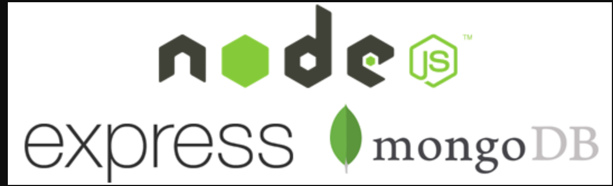

# Toothcrate-backend Coder Academy Term 3 Project -

### Backend half (server, API, database) for a dental practice inventory system.

* The project outline was to: Design, build, deploy and present an application
  built for a real world customer. Meet with the business owner or organisation
  manager to find out what challenges they face. Find a problem that you can
  solve with an application and present your ideas to the client.

* Please see [this repo](https://github.com/DeadFred121/toothcrate-front) for a
  detailed README file. [Project Link](http://toothcrate.netlify.com)

### Tech Stack



### Installation

You can access the application through heroku: https://toothcrate.herokuapp.com
Or you can download the project to the local drive and run it from there:

Clone the server side repo:

```
$ git clone https://github.com/FilipMaslovaric/Toothcrate-backend
```
